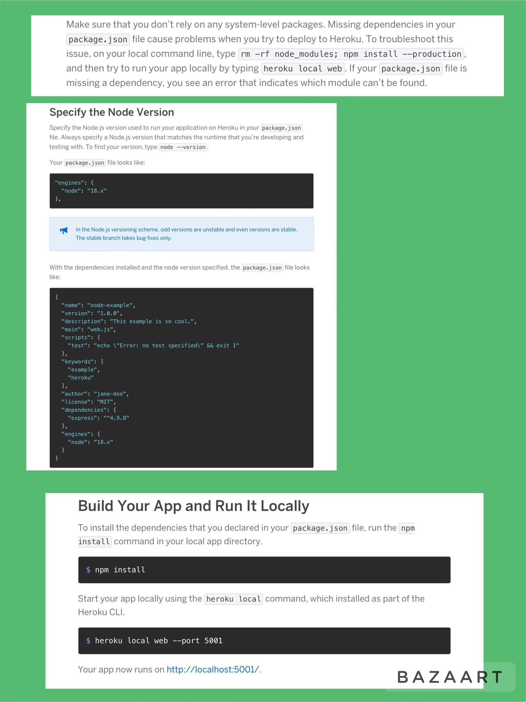

# chall-eleven-note-taker-app-express-js

Note taking application, featuring Express.js, that allows you to write/save notes.

## Description

A note taking application, featuring Node & Express.js, that allows user to write & save notes. I was given starter code for this project. It included a git ignore file, and all of the other starter code is in the Develop folder. ( Essentially, all of the front end of this application, has been provided.) This project is deployed on Heroku, and uses Insomnia for API testing. When user is directed to homepage, should be able to press the get started button and be directed to the notes application.
Save Icon: should be on top of page.
Existing Notes: should be on left-hand side
Empty Notes: right-side column.
When you click on existing note in left-hand side,
the note should appear in right-hand side column.
Should be a Write Icon at top of page.
Write new notes in right-side column.

## Table of Contents

:bookmark_tabs:

- [Installation](#installation)
- [Links](#links)
- [Express](#express)
- [Insomnia](#insomnia)
- [Heroku](#heroku)
- [UUID](#uuid)
- [Ports and HTTP](#ports-and-http)
- [MISC](#misc)
- [Key-Topics](#key-topics)
- [Homework That I Looked Back On](#homework-referred-back-to)
- [Notes on Application](#notes-on-application)
- [License](#license)
- [How to Contribute](#how-to-contribute)
- [Credits](#credits)
- [Badges](#badges)
- [Tests](#tests)
- [Features](#features)

## Installation

:arrow_down:

:arrow_forward: [Starter Code : Click Me To Go To Link](https://github.com/coding-boot-camp/miniature-eureka)

:arrow_forward: [Github Link : Click Me To Go To Link](https://github.com/pmastropolo/module-eleven-challenge-note-taker-express-js)

:arrow_forward: [Deployed Heroku Page : Click Me To Go To Link]

## Links

:open_file_folder:

:arrow_forward: Starter Code: https://github.com/coding-boot-camp/miniature-eureka

:arrow_forward: Github link:https://github.com/pmastropolo/module-eleven-challenge-note-taker-express-js

:arrow_forward: Deployed Heroku Page Link:

## Express

- [Hello World Example](https://expressjs.com/en/starter/hello-world.html)
- [API vs. HTML routes](https://expressjs.com/en/guide/routing.html#response-methods)
- [req.query and params](https://expressjs.com/en/guide/routing.html#route-parameters)
- [GET with Fetch API](https://expressjs.com/en/guide/routing.html#route-parameters)
- [Middleware for Static Files](http://expressjs.com/en/starter/static-files.html)
- [Post Requests and Routes](https://expressjs.com/en/starter/basic-routing.html)
- [Middleware for body parsing](http://expressjs.com/en/api.html#req.body)
- [Modular Routing](http://expressjs.com/en/guide/routing.html#express-router)
- [Custom Middleware](https://expressjs.com/en/guide/writing-middleware.html)
- [express()](https://expressjs.com/en/4x/api.html)
- [Express Notes](https://flaviocopes.com/express/)
- [Express](https://expressjs.com/)
- [ExpressJS - Serving static files](https://www.tutorialspoint.com/expressjs/expressjs_static_files.htm#:~:text=Static%20files%20are%20files%20that,the%20following%20built%2Din%20middleware.)
- [Express Router for modular code](https://medium.com/nerd-for-tech/express-router-for-modular-code-f155d4406897)

## Insomnia

- [Get Started: Insomnia](https://docs.insomnia.rest/insomnia/get-started)
- [Install Insomnia](https://docs.insomnia.rest/insomnia/install)

## Heroku

- [Heroku: Getting Started](https://devcenter.heroku.com/articles/getting-started-with-nodejs?singlepage=true)
- [How to Install](https://coding-boot-camp.github.io/full-stack/heroku/how-to-install-the-heroku-cli)
- [The Heroku CLI](https://devcenter.heroku.com/articles/heroku-cli)
- [Heroku](https://www.heroku.com/)
- [Heroku Deployment Guide](https://coding-boot-camp.github.io/full-stack/heroku/heroku-deployment-guide)
- [Heroku vs AWS: What is the Difference?](https://www.guru99.com/heroku-vs-aws.html)

## UUID

- [Node.js uuid](https://www.geeksforgeeks.org/node-js-npm-uuid/?fbclid=IwAR0EeXfW4N02R_VBert3CjhWi2voJ7N_WQZbD6zB0RJZ953ZJUaGyGvrjYU)
- [uuid npm](https://www.npmjs.com/package/uuid)

## Ports and HTTP

- [Ports and HTTP](https://computer.howstuffworks.com/internet/basics/internet-infrastructure10.htm)
- [An overview of HTTP](https://developer.mozilla.org/en-US/docs/Web/HTTP/Overview)
- [Port](https://developer.mozilla.org/en-US/docs/Glossary/Port)
- [Client-Server Overview](https://developer.mozilla.org/en-US/docs/Learn/Server-side/First_steps/Client-Server_overview#anatomy_of_a_dynamic_request)
- [POST](https://developer.mozilla.org/en-US/docs/Web/HTTP/Methods/POST)
- [HTTP Request Methods](https://www.w3schools.com/tags/ref_httpmethods.asp)
- [How are parameters sent in an HTTP POST request?](https://stackoverflow.com/questions/14551194/how-are-parameters-sent-in-an-http-post-request)
- [Understanding HTML Form Encoding](https://dev.to/sidthesloth92/understanding-html-form-encoding-url-encoded-and-multipart-forms-3lpa)

## MISC

- [POST with Fetch API](https://developer.mozilla.org/en-US/docs/Web/API/Fetch_API/Using_Fetch)
- [Data persistence using JSON](https://nodejs.org/api/fs.html#fs_file_system)
- [Full Stack Blog](https://coding-boot-camp.github.io/full-stack/)
- [MySQL Installation Guide](https://coding-boot-camp.github.io/full-stack/mysql/mysql-installation-guide)
- [What is data persistence?](https://www.futurelearn.com/info/courses/programming-103-data/0/steps/64745)

## Key-Topics

## Homework Referred Back To

Dont want to post all the hw, since this is a public repo

### Notes on Application

## License

:heavy_exclamation_mark:

MIT License

## How to Contribute

:tada:

N/A

## Credits

:name_badge:

N/A

## Badges

:trophy:

N/A

## Tests

N/A

## Features

:sparkler:

N/A
